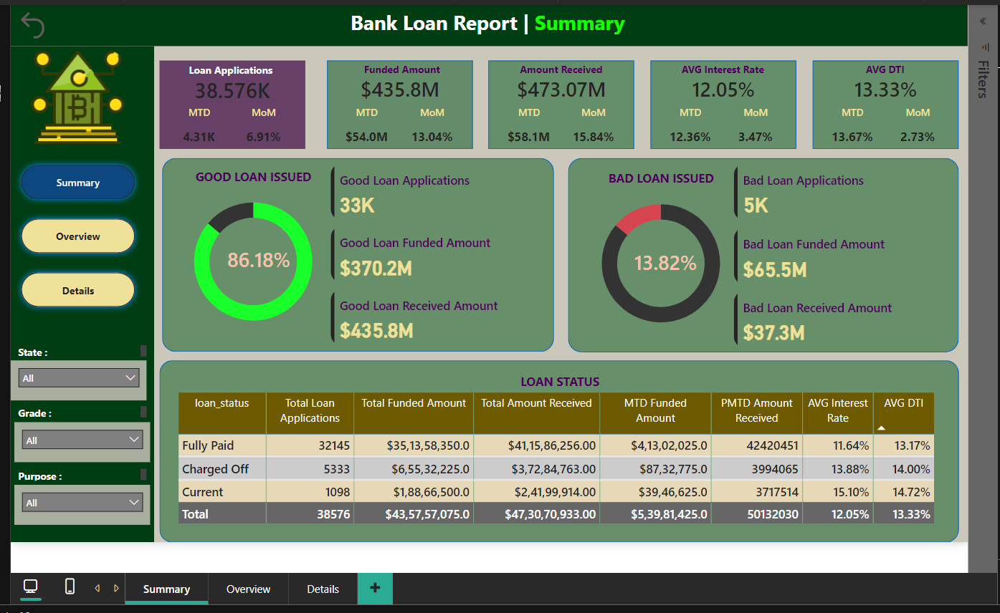
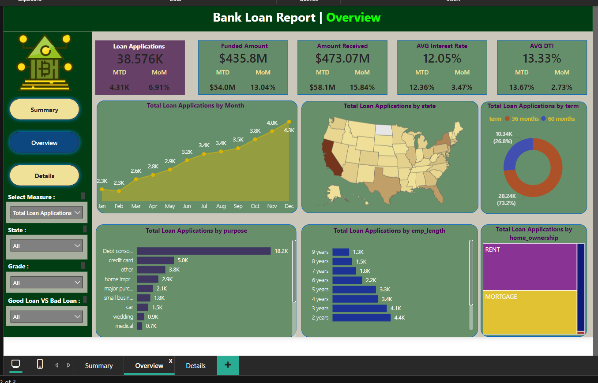

# Bank Loan Dashboard - Power BI + SQL Project

## Project Overview

This project provides a comprehensive overview of a bank's loan applications and their statuses using Power BI for data visualization and SQL for data extraction and transformation. The dashboard helps stakeholders monitor loan performance, including good loans issued, bad loans, and key metrics such as interest rates, loan amounts, and debt-to-income ratios.

### Key Features:
- **Loan Applications Summary:** Displays the total number of loan applications, funded amounts, and the status of good vs. bad loans.
- **Loan Metrics Overview:** Highlights key metrics such as the average interest rate, average DTI (debt-to-income ratio), and amounts received versus funded.
- **Detailed Loan Insights:** Provides in-depth information on loan performance by various attributes, including loan term, loan purpose, and employment length.

## Dashboard Terminologies

The dashboard uses the following key terms:

- **Loan ID:** Unique identifier for each loan application.
- **Address State:** Borrower's location used to assess geographic risks.
- **Employee Length:** Number of years the borrower has been employed.
- **Employee Title:** Borrower's job title, which provides insights into their financial capacity.
- **Grade & Sub Grade:** Classification of loans based on creditworthiness.
- **Home Ownership:** Borrower's housing status, which affects loan stability.
- **Issue Date:** Date when the loan was originated.
- **Last Credit Pull Date:** Date when the borrower’s credit was last checked.
- **Last Payment Date:** Date of the most recent payment received.
- **Loan Status:** Current state of the loan (e.g., fully paid, charged off).
- **Next Payment Date:** Upcoming scheduled payment date.
- **Purpose:** Reason for the loan (e.g., debt consolidation, education).
- **Term:** Duration of the loan (typically 36 or 60 months).
- **Verification Status:** Indicates if the borrower’s financial information is verified.
- **Annual Income:** Total yearly earnings of the borrower.
- **DTI (Debt-to-Income Ratio):** Ratio of the borrower’s monthly debt payments to their income.
- **Instalment:** Monthly payment due, including interest and principal.
- **Interest Rate:** Annual cost of borrowing.
- **Loan Amount:** Total amount borrowed by the applicant.

## Screenshots

### 1. **Bank Loan Report - Summary**

The first screenshot highlights a high-level summary of the total loan applications, funded amounts, and key financial metrics such as the average interest rate and DTI. This summary provides a quick overview of the loan performance during the specified period.

### 2. **Bank Loan Report - Overview**

The second screenshot showcases an overview of various loan metrics. This includes a breakdown of loan applications by state, grade, good vs. bad loans, and other factors such as loan term and employment length.

### 3. **Bank Loan Report - Details**

The third screenshot provides detailed insights into each loan, including the purpose, home ownership, grade, issue date, funded amount, interest rate, installment, and total amount received. This view allows for granular analysis of individual loan performance.

## Data Source

The data for this project was extracted and transformed using SQL queries from a bank's loan database. It includes real-time data on loan applications, statuses, and financial metrics. The data is then visualized in Power BI to provide stakeholders with easy-to-understand insights.

### SQL Queries:
- **Data Extraction:** SQL queries were used to pull data on loan applications, statuses, and key metrics from the bank's database.
- **Data Transformation:** The data was cleaned, aggregated, and formatted for visualization using SQL before being loaded into Power BI.

## Visualizations

The Power BI dashboard includes the following sections:

1. **Summary:** 
   - Total loan applications (e.g., 38.576K)
   - Funded amounts, amounts received, average interest rates, and DTI.
   - Breakdown of good loans vs. bad loans issued.
   
2. **Overview:**
   - Total loan applications by month, state, purpose, employment length, and term.
   - Graphical representation of the trends in loan applications.
   
3. **Details:** 
   - Loan performance metrics by loan status, showing fully paid, charged-off, and current loans.
   - MTD (Month-to-Date) and PMTD (Prior Month-to-Date) loan metrics.

